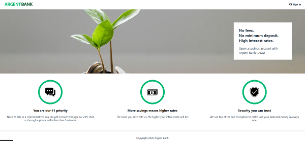
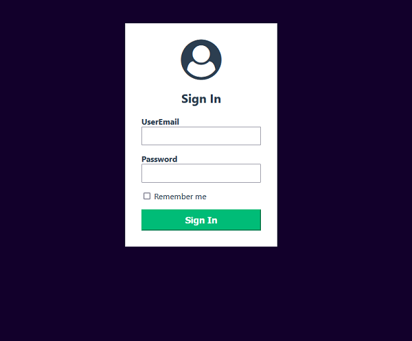
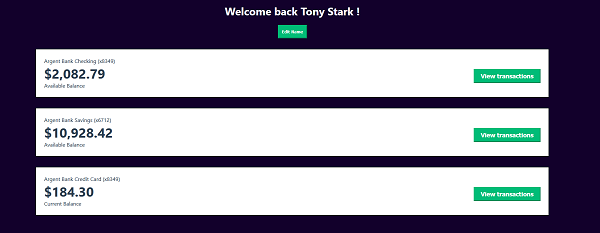

# ArgentBank Front-End

## Description

ArgentBank is a banking app that allows users to view their bank accounts with a secure connection. This is achieved through a JWT (JSON Web Token).

Developed using React, Redux, and RTK Query for REST API calls, ArgentBank offers robust state management and efficient API interactions for a seamless user experience.

## Stack

-   React
-   Redux, RTK, RTK Query
-   CSS
-   REST API
-   Swagger
-   JWToken

## Lessons Learned

During this project, I learned how to use Redux and Redux Toolkit to manage the application's state, as well as Redux Toolkit Query to to interact with a REST API using JSON Web Token.

## Screenshots

Home page  

Sign In page  

Account page  

## Authors

[Yacine D](https://github.com/Yacine-Di)
